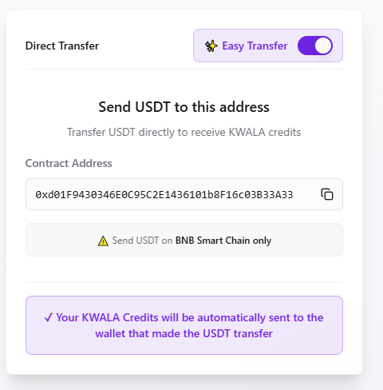

Kwala uses a credit-based model for your workflow executions.  Credits are consumed for trigger executions, workflow activations, API calls, cross-chain transactions, and stateful write operations.  This guide explains how to acquire, manage, and monitor your Kwala credits.

## Prerequisites

Before purchasing Kwala credits, ensure you have:

- **MetaMask wallet** installed and configured
- Your wallet configured for **BNB Smart Chain network**
- **USDT** tokens on BNB Smart Chain for payment

## How to purchase Kwala credits

There are two methods for purchasing Kwala credits using USDT on BNB Smart Chain. To get started, navigate to [payments.Kwala.network](https://payments.Kwala.network/).

<Info>
  **Network**: All transactions are processed on **BNB Smart Chain**. Ensure you have USDT on BSC network.
</Info>

<Frame>
  
</Frame>

## Method 1: Wallet swap (recommended)

The Wallet Swap method allows you to directly swap USDT for Kwala credits from your connected wallet. It works well when you already have USDT in your connected wallet and want Kwala credit instantly credited into your account.

<Steps>
  <Step title="Connect your wallet">
    Visit [payments.Kwala.network](https://payments.Kwala.network/) and select **Connect Wallet**. A pop up appears, where you select your wallet from the available options and approve the connection.
  <Frame>
    
  </Frame>
  </Step>
  
  <Step title="Select wallet swap tab">
    On the payment portal, ensure the **Wallet Swap** tab is selected (it should be active by default).
  </Step>
  
  <Step title="Enter USDT amount">
    In the **You Pay** field:
    - Enter the amount of USDT you want to swap
    - Your wallet balance will be displayed for reference
    - The **You Receive** field will automatically display the Kwala credits you'll get
    - Enter your wallet address in the **Recipient Wallet Address** field
  <Frame>
    
  </Frame>
  </Step>
  
  <Step title="Review exchange details">
    Verify the following information:
    - **You Pay**: Amount in USDT
    - **You Receive**: Equivalent Kwala credits
    - **Block Triggers**: Number of block triggers included
    - **Exchange Rate**: Current conversion rate (49 USDT = 20 Kwala)
  </Step>
  
  <Step title="Confirm and swap">
    Select the **Get Kwala Credits** button and approve the transaction in your wallet. The swap will be processed instantly on BNB Smart Chain.
  </Step>
  
  <Step title="Verify credit balance">
    Once the transaction is confirmed, your Kwala credits will be added to your address immediately. Your credit balance will also reflect in the Kwala dashboard as shown:
    <Frame>
      
    </Frame>
  </Step>
</Steps>

## Method 2: Easy transfer

The Easy transfer method allows you to send USDT from any wallet to purchase Kwala credits for a specific recipient address.

<Steps>
  <Step title="Access payment portal">
    Visit [payments.Kwala.network](https://payments.Kwala.network/) and select "Connect Wallet" to access the portal.
  </Step>
  
  <Step title="Select easy transfer tab">
    Use the toggle button to switch to the **Easy Transfer** tab to change the payment method.
    <Frame>
      
    </Frame>
  </Step>
  
  <Step title="Copy the payment address">
    Copy the provided USDT payment address displayed on the Easy Transfer page.
  </Step>
  
  <Step title="Send USDT from your wallet">
    Open your wallet and send the desired amount of USDT to the copied address on BNB Smart Chain. The amount you send will determine how many Kwala credits you receive based on the current exchange rate.
  </Step>
  
  <Step title="Receive Kwala Credits">
    Once you've sent the USDT, Kwala credits will be automatically credited to the wallet address that made the transfer. Your credit balance will reflect on the Kwala dashboard. 
  </Step>
</Steps>

<Warning>
  Double-check the recipient Kwala address when using Easy Transfer. Transactions cannot be reversed once confirmed.
</Warning>

## Workflow execution and credit deduction

Every time you run a Kwala workflow, credits are automatically deducted from your Kwala address:

- Credits are deducted based on the complexity and resources used by your workflow
- Failed workflows may still consume minimal credits for processing
- Monitor your balance and usage on the Kwala Dashboard or explorer
- Get notified when your credit balance runs low to avoid workflow interruptions

<Tip>
  Ensure you have sufficient credits in your Kwala address before executing workflows. You can recharge at any time through the Kwala Payments page.
</Tip>

## Monitor your credits

You can monitor your credits usage in real-time on the Kwala dashboard. From  the dashboard, you can view your current credit balance in your wallet and track credit deductions for each workflow execution. Kwala also allows you to set up notification alerts when credits are running low. If you'd like detailed insights into the transaction logs, use the [Kwala Explorer](https://Kwala-explorer.lovable.app/)

## Credit pricing

For detailed pricing information and credit packages, visit our [pricing page](https://Kwala.network/pricing).

## Frequently asked questions about Kwala Credits

<AccordionGroup>
  <Accordion title="Do credits expire?">
    No, Kwala credits do not expire. They remain in your account until used.
  </Accordion>
  
  <Accordion title="Can I get a refund for unused credits?">
    Please refer to our terms of service for refund policies.
  </Accordion>
  
  <Accordion title="What happens if a workflow fails?">
    Failed workflows may consume minimal credits for the processing attempt, but not the full execution cost.
  </Accordion>
  
  <Accordion title="Can I transfer credits to another account?">
    Credits are tied to your Kwala address and cannot be transferred.
  </Accordion>
</AccordionGroup>

Contact our [support team](/support/overview) for assistance with credits and billing.

## Next steps

<CardGroup cols={2}>
  <Card title="Start building" icon="hammer" href="/workflow-builder/create-workflow">
    Create your first workflow
  </Card>
  
  <Card title="View limits & quotas" icon="gauge" href="/concepts/limits-and-quotas">
    Understand execution limits
  </Card>
</CardGroup>
